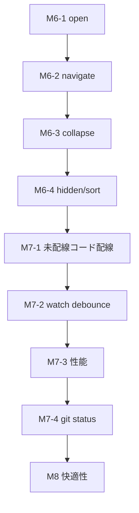

# fyler for windows — 実用化フェーズ計画(M6〜M8)

> 2026-07-04 作成。M5完了(コア編集フロー成立)を受けて、「ファイラーとして日常使用に耐える」
> ことをゴールに次フェーズを設計する。設計の正典は [DESIGN.md](DESIGN.md)。
> 本書はその「マイルストーン」章の延長であり、矛盾した場合はDESIGN.mdを優先する。

## 現状の到達点と欠落(2026-07-04 棚卸し)

**できること**: ツリー表示(全階層展開)、vim編集による rename/create/delete/move/copy、
確認ダイアログ → apply → reconcile、外部変更検知(通知/再読込)、クロスボリューム3分類、
ごみ箱削除、case-onlyリネーム、アイコン装飾、IDプレフィックス隠蔽。

**できないこと(=ファイラーとして致命的な欠落順)**:

1. **ファイルを開けない** — `<CR>` は `fyler_action_blocked`(M1のプレースホルダ)のまま
2. **ルートを移動できない** — 起動時の引数ディレクトリに固定。上位へも下位へも移れない
3. **折りたたみがない** — 常に全階層展開。大きなツリーで実用にならない
   (EditContext::collapsed_dirs のパイプライン対応は実装済みだが、GUI/エンジン側の操作がない)
4. **隠しファイルの区別がない** — dotfile・hidden属性が常に全表示
5. **git statusがない** — M5でスコープ外にした残件
6. **ソートが素朴** — バイト順。ディレクトリ優先・自然順(numeric-aware)でない
7. **ファイル情報が見えない** — サイズ・更新日時・属性の表示がない
8. **性能の頭打ち** — 起動時に全階層スキャン、watch イベントごとに全再スキャン、
   `BaselineTree::get` が O(n)(diff全体で O(n²))
9. **Windows堅牢性の残件** — `long_path::to_extended` / `onedrive::is_cloud_placeholder` /
   `case::dir_is_case_sensitive` が実装済みだが**未配線**(呼び出し元ゼロ)

## M6: ファイラーとして成立させる(open / navigate / collapse)

> **実装済み(2026-07-05)**。M6-1〜M6-4すべてLinuxゲート(fmt/test/clippy/クロスターゲット)pass。
> Windows実機での完了条件確認(ShellExecuteW・GUI目視)のみ未実施。

「見る・開く・移動する」の基本動作。**実FS書き込み経路には一切触れない**ため、
絶対ルール1のリスクなしに進められる。

### M6-1: ファイルを開く(`<CR>`)

- guard.rs の `<CR>` remapを `fyler_action_blocked` から `fyler_open`(カーソル行番号付き
  rpcnotify)に差し替える
- engine.rs で `fyler_open` → **エンジン非依存イベント** `EditorEvent::ActivateLine { line: usize }`
  に変換(絶対ルール2: 行の解釈はエンジンでしない。nvim語彙はここで消える)
- app層(main.rs)が snapshot の該当行を `grammar` でparseし判定:
  - **ファイル行** → `fyler-fsops` に新設する `open::open_with_default_app(path)`
    (Windows: `ShellExecuteW(open)`。windowsクレート依存はfsopsのみ=境界維持)
  - **ディレクトリ行** → M6-3の折りたたみトグルへ
- 開く操作は読み取り専用なので確認ダイアログ不要

### M6-2: ルート移動(`-` で上へ / ディレクトリへ潜る)

- `-`(oil.nvim/vim-vinegar互換)を `fyler_parent` にremap → `EditorEvent::NavigateParent`
- ルート変更の手順(app層):
  1. dirty なら中断してメッセージ(「保存/破棄してから移動」)— 編集の黙殺を防ぐ
  2. 新ルートを `scan_baseline`(IdAllocatorは新規に振り直す)
  3. `SaveController` にbaseline/ids差し替えAPIを追加(`set_root(root, ids, baseline)`)
  4. `FsWatcher` を drop → 新ルートで再watch
  5. `SetLines` でバッファ差し替え
- タイトルバー/モードラインに現在ルートを表示(現状は起動時固定)

### M6-3: 折りたたみ(`za` 相当 / ディレクトリ行で `<CR>`)

パイプライン(validate/diff)は `EditContext::collapsed_dirs` を既に解釈できる。
足りないのは「バッファから子孫行を出し入れする」操作のみ。

- collapse: 対象ディレクトリの子孫行をバッファから削除し、IDを `collapsed_dirs` に追加
- expand: baselineから子孫行を再生成して挿入し、`collapsed_dirs` から除去
- **dirty中の折りたたみは拒否**(編集途中の行を機械的に消すとundo履歴と衝突する。
  まず保存を促す。緩和は後続で検討)
- 初期表示を「ルート直下のみ展開」に変更 → M6で最大の体感性能改善
- `SaveController` と GUI の `collapsed_dirs` の同期は app層が一元管理する
  (reconcile/external changeで `EditContext::default()` にリセットしている現行箇所は、
  「実在するIDのみ残す」フィルタに変える)

### M6-4: 隠しファイルのトグル(`g.` 相当)

- scan.rs に `ScanOptions { show_hidden: bool }` を追加。既定は隠す:
  - 名前が `.` 始まり、または(Windows)`FILE_ATTRIBUTE_HIDDEN`(GetFileAttributesW は
    onedrive.rs に前例あり。属性取得ヘルパーをfsops内で共通化)
- 「隠す」= baselineに**含めない**(collapsed_dirsと違い、diffのDelete判定に載せない。
  トグル時は再スキャン+SetLines。dirty中は拒否 — M6-3と同じ規律)
- ソートも同時に修正: ディレクトリ優先 + case-insensitive自然順(`1.txt < 2.txt < 10.txt`)。
  scan.rs の `read_sorted_entries` に閉じる変更

### M6の完了条件

- `<CR>` でファイルが既定アプリで開く(Windows実機)← **実機確認のみ残**
- `-` / `<CR>` でルート移動・折りたたみが機能し、dirty中は安全に拒否される ← 実装済み
- 初期表示がルート直下のみで、10万エントリ級のツリーでも起動が体感即時 ← 実装済み(実機計測残)
- 既存の保存フロー(rename→:w→確認→apply)が折りたたみ状態でも正しく動く
  (collapsed dirのrename = 親Move 1件、はテスト済みの契約)

## M7: Windows堅牢性と性能(実用の信頼性)

> **実装済み(2026-07-05)**。M7-1/M7-2/M7-3(インデックス化)/M7-4すべて
> Linuxゲート(fmt/test/clippy/クロスターゲット)pass。
> **Windows実機テスト・挙動確認OK(2026-07-05、ユーザー確認)**。
> trashクレートの拡張形式パス受け入れ(MAX_PATH超のごみ箱削除)のみ実機未検証(recycle.rs参照)。

### M7-1: 未配線コードの配線(実装済み・呼び出しゼロの3件)

| 関数 | 配線先 | 内容 |
|---|---|---|
| `long_path::to_extended` | apply.rs の全FS操作 + scan.rs | `#[cfg(windows)]` でパスを拡張形式に変換してから `fs::*` に渡す。MAX_PATH(260)超で現状**全操作が失敗する** |
| `onedrive::is_cloud_placeholder` | apply.rs のCopy/Move(クロスボリューム) | プレースホルダのcopyはhydrationを誘発する。確認ダイアログに「クラウドから取得します(サイズ)」を明示 |
| `case::dir_is_case_sensitive` | validate配線(app層)+ apply preflight | `FILE_CASE_SENSITIVE_DIR` 実測。現状の保守的fold(検証済み)を実測値で精緻化 |

- 注意: `trash` クレートに拡張形式パスを渡せるかは要検証(M7で最初に確認)

### M7-2: watchのdebounce/coalesce

現状: notifyイベント1個 → `ExternalChange` 1個 → **全再スキャン**。
`git checkout` / `npm install` で数百〜数千イベント = 数百回スキャン。

- watch.rs 内で 200ms のdebounceウィンドウを実装(イベントを溜めて1個に潰す。
  パスは集合で保持し、将来の部分再スキャンに備える)
- main.rs 側の `try_recv` による既存coalesceは残す(二段防御)

### M7-3: 性能の基礎工事

- `BaselineTree` に `HashMap<EntryId, usize>` インデックスを追加(`get` O(1)化。
  insert時に構築。diff全体が O(n log n) 程度になる)
- 再スキャンの差分化はM7では**やらない**(全スキャン+ID維持で十分速い。
  計測して遅ければM8で部分再スキャン)

### M7-4: git status装飾

- 実装場所: fyler-fsops に `gitstatus.rs` 新設(プロセス起動は「FS読み取り」の親戚。
  依存境界表にgit2等の新依存は**足さない** — `git status --porcelain=v1 -z` をspawnして
  パースする。gitがなければ静かに無効)
- 表示: tree_view.rs の装飾列(アイコンと同じ仕組み。バッファ文字列に含めない —
  DESIGN.md「GUI」章の既定通り)
- 更新タイミング: baseline再スキャンと同時 + apply後reconcile時

### M7の完了条件

- 260字超パスで create/rename/delete が成功(Windows実機)
- OneDriveプレースホルダのmoveで意図しないhydrationが起きない(実機・目視)
- `git checkout` 直後もUIが固まらず、1〜2回の再スキャンに収まる(ログで確認)
- git変更ファイルにバッジが出る

## M8: 快適性(使い続けたくなる要素)

優先度順。各項目は独立しており、個別に出荷できる。

1. **ファイル情報表示**: カーソル行のサイズ・更新日時をモードラインに表示
   (プレースホルダはメタデータのみ=hydration禁止の契約を守る。onedrive.rs活用)。
   列表示(ls -l風)はconcealとカーソル補正が絡むため、モードライン表示で始める
2. **確認ダイアログのキーボード操作**: `y`/`n`/`<Esc>`(現状ボタンクリックのみ。
   vim使いの動線で毎回マウスは苦痛)
3. **パスのコピー**(`gy` 相当): カーソル行の絶対パスをクリップボードへ(eguiのclipboard APIで足りる)
4. **ブックマーク/最近使ったルート**: `~/.config/fyler/`(Windows: `%APPDATA%`)にTOML保存。
   cmdline `:b name` でジャンプ
5. **設定ファイル**: 隠しファイル既定・ソート順・確認ダイアログの詳細度。
   ブックマークと同じTOML
6. **バッファロックの実装**(`SetModifiable`): save.rsの契約に既にあるが未実装。
   `EditorCommand::SetModifiable(bool)` を追加し `nvim_set_option_value("modifiable")` に配線。
   確認ダイアログ中の「:wからダイアログ表示までの入力すり抜け」ウィンドウが閉じる

## 実装順序とリスク

- **M6-3(折りたたみ)が最大のリスク**: バッファ書き換えとundo履歴・dirty状態の相互作用。
  「dirty中は拒否」の規律で初版を出し、実機で使用感を見てから緩和する
- **M6-2のSaveController差し替え**は状態機械がIdle以外のときに来ないようGUIでゲートする
  (確認ダイアログ表示中のルート移動は拒否)
- M7-1のlong_path配線は全FS操作のパスを触るため、apply.rsのテストを
  Windows GNU クロスターゲット + 実機の両方で回す(fyler-windows-cfg-windows-crosscheck スキル)

## このフェーズでやらないこと(明示的スコープ外)

- タブ・分割ペイン(単一ルートのまま)
- ファイル内容プレビュー(hydration リスクと表示設計が重い。M9候補)
- fuzzy finder(`:`のcmdlineは既に開放されている。専用UIはM9候補)
- 再スキャンの完全差分化(M7-3の計測結果次第)
- IFileOperation COM API への削除置き換え(trashクレートで問題が出るまで保留)
